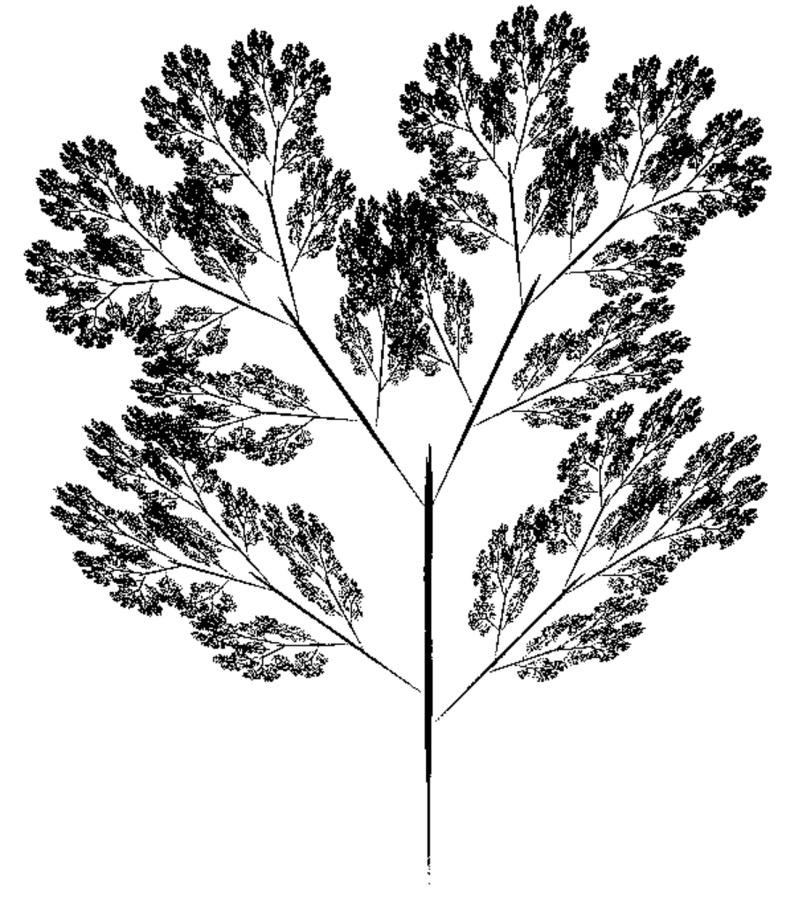

I have written a Python code, in which series of different types and variations of fractalas are displayed in the screen with it showing how the fractal is formed from the start. 2 main techniques were used: L-system and IFS (iterated function system).

Here is one of my own creations, which is a mix of Barnsley's repetitional fractals, and a base structure from Bourke:
### IFS Maple Leaf

Inspired by the multiple fractals by Paul Bourke, but changed to personal preference:
### 'Real' IFS Tree

One of the mainly known fractals made by Michael Barnsley:
### Barnsley Fern

#Make it appealing to the reader, include maple leaf as first, mention the inspo from Paul Bourke (outline) and Fern (repeating leaves)

### Koh Snowflake

### L-system Dragon Curve

### IFS Dragon Curve

### L-system Sierpinski Triangle

### IFS Sierpinski Triangle

### IFS Sierpinski Carpet

### L-system Dragon Curve

