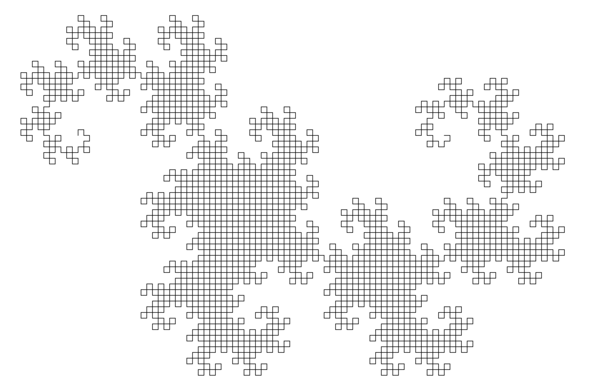

I have written a Python code, in which series of different types and variations of fractalas are displayed in the screen with it showing how the fractal is formed from the start. 2 main techniques were used: L-system and IFS (iterated function system)\

### L-system Dragon Curve

