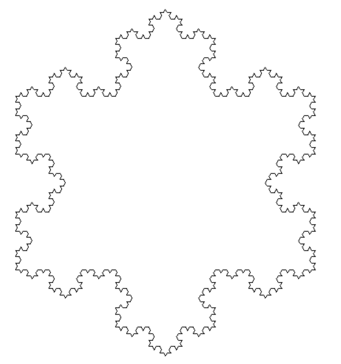
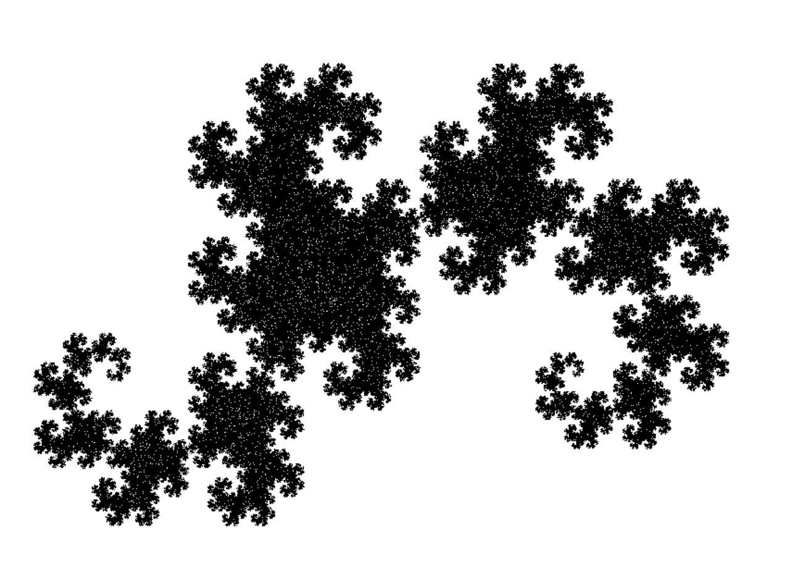

I have written a Python code, in which series of different types and variations of fractalas are displayed in the screen with it showing how the fractal is formed from the start. 2 main techniques were used: L-system and IFS (iterated function system).

There are 2 main types of creating fractals: IFS and Lindenmayer system (L-system).
The L-system uses a recurring, rule based system in which the axiom (start pattern) is extended using the rules of the set fractal. The amount of times it is done is set by the iteration.

Here is the rules, axiom for each iteration of the Koch Snowflake:

### Koh Snowflake

### L-system Dragon Curve

### IFS Dragon Curve

