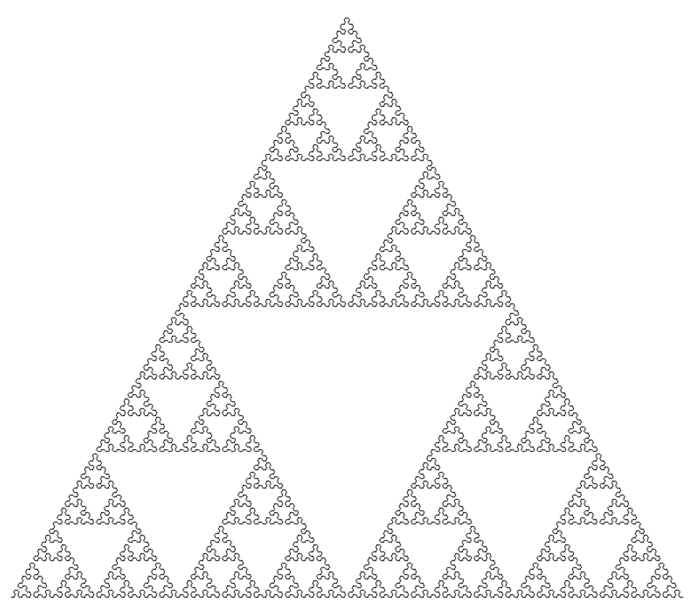

I have written a Python code, in which series of different types and variations of fractalas are displayed in the screen with it showing how the fractal is formed from the start. 2 main techniques were used: L-system and IFS (iterated function system).

There are 2 main types of creating fractals: IFS and Lindenmayer system (L-system).
The L-system uses a recurring, rule based system in which the axiom (start pattern) is extended using the rules of the set fractal. The amount of times it is done is set by the iteration.

Here is one of my own creations:
### IFS Maple Leaf

Inspired by the multiple fractals by Paul Bourke
### IFS Tree

One of the mainly known fractals made by Michael Barnsley:
### Barnsley Fern

#Make it appealing to the reader, include maple leaf as first, mention the inspo from Paul Bourke (outline) and Fern (repeating leaves)

### Koh Snowflake

### L-system Dragon Curve

### IFS Dragon Curve

### L-system Sierpinski Triangle

### IFS Sierpinski Triangle

### IFS Sierpinski Carpet

### L-system Dragon Curve

